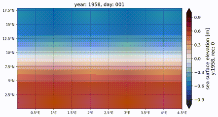
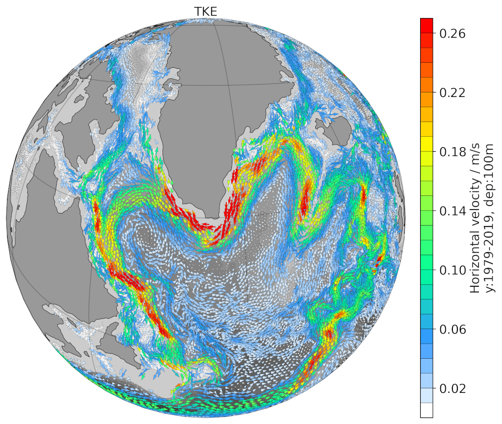
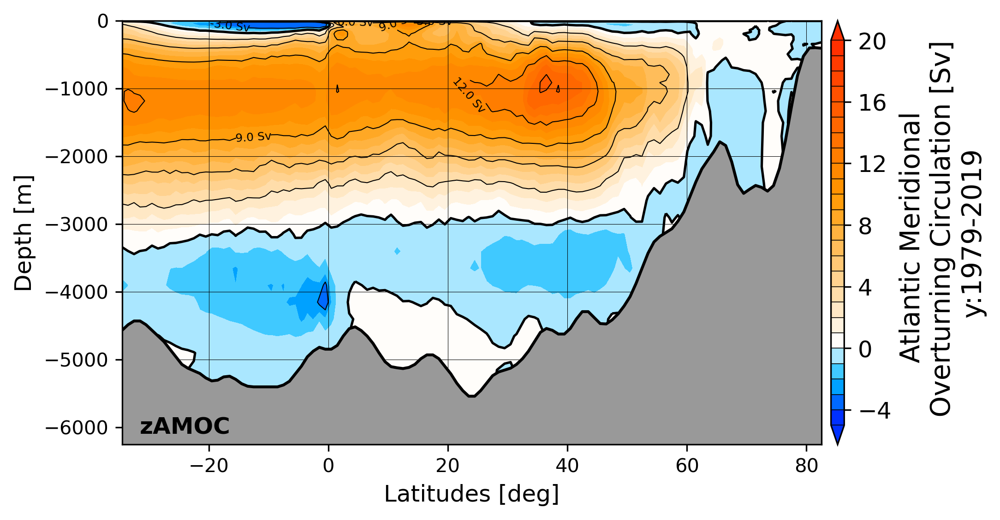
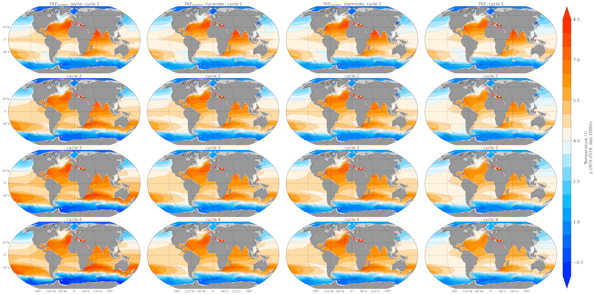

#  ----------------- Tripyview ----------------- 
<br />
<br />
<br />
<br />
Triangular plotting and diagnostics for FESOM2 + command line utility similar to 
fdiag using plotting suite of Patrick.Scholz@awi.de (former fesom2/view_pscholz folder). 
Data reading got updated to xarray, plotting got updated to cartopy, actually works well for 
python=3.8. It is tested upto dart mesh size (3M surface vertices) where it allows for a decend 
working speed (but only when used in parallel)
<br />
version: 0.3.0
<br />

## Installation

In moment only possible by source files using pip:

### 1st. clone respository: 
```bash
git clone https://github.com/patrickscholz/tripyview
```

### 2nd. install using conda & pip : 
make sure your conda environment uses python=3.8 (conda create --name myenvpy38 python=3.8; conda activate myenvpy38)

```bash
# look like cartopy causes trouble when installed via pip so better preinstall via
# conda also netcdf4>=1.6.1 causes occasionally netcdf4-->hdf5 error messages, therefor 
# stick for the moment to netcdf4=1.6.0
# If you want to use the interactive features in tools/do_topo@elem_or_node.ipynb
# due to python issues you will need jupyter_server=1.23.6, jupyter_client=7.3.2, 
# tornad=6.1 --> its the only combination where this features works in moment!!!
conda install -c conda-forge cartopy netcdf4=1.6.0 libstdcxx-ng 
(libstdcxx-ng is needed so that pyvista is able to plot interactively, python=3.8)
cd tripyview
pip install -e .

(pip install jupyter_server==1.23.6 jupyter_client==7.3.2 tornado==6.1)
```

## Different diagnostics
### see ./template_notebook/:

#### General plotting: 
* `hmesh`          - plot horizontal fesom2 mesh in various projections (plot: mesh, topographie, 
vertice/element- resolution and area)
<p align="center" width="68%">
  
  
</p>

* `hslice`           - plot horizontal slices for ocean variable (compute depth and time averages)
* `hslice_np`        - plot horizontal slices for ocean variable north polar stereographic projection
* `hslice_sp`        - plot horizontal slices for ocean variable south polar stereographic projection
* `hslice_clim`      - plot horizontal slices of temperature, salinity and density climatology (compute depth and time averages)
* `hslice_clim_np`   - plot horizontal slices of temperature, salinity and density climatology in north polar stereographic projection
* `hslice_clim_sp`   - plot horizontal slices of temperature, salinity and density climatology in south polar stereographic projection
* `hslice_isotdep`   - plot horizontal slices of depth of distinct isotherm (default: 12°C isotherm)

* `hslice_channel`   - plot horizontal slices of variables in the channel configuration (provide routine to make channel movie)
<p align="center" width="100%">
  
</p>

* `hquiver`          - plot horizontal arrow vector field in various projections
<p align="center" width="100%">
  
</p>

* `hovm`             - plot hovmöller diagramms for 3d ocean variable over depth and time averaged over
specific region that is defined by shapefile (see. tripyview/shapefiles/...)
* `hovm_clim`        - plot hovmöller diagramms for  temperature, salinity and density climatology 
over depth and time averaged over specific region that is defined by shapefile (see. tripyview/shapefiles/...)

* `transect`         - plot point wise transects of 3d ocean variables
* `transect_clim`    - plot point wise transects of 3d temperature, salinity and density climatology
* `transect_transp`  - plot volume transport through arbitrary transects (model accurate transport)
* `transect_transp_t`- plot time-series of volume transport through arbitrary transects (fesom2 model accurate transport)
* `transect_zmean`   - plot zonally averaged transects of 3d ocean variables
* `transect_zmean_clim`- plot zonally averaged transects of 3d temperature, salinity and density climatology
<p align="center" width="100%">
  
  
  
</p>

* `vprofile`         - plot lines for averaged vertical profile of 3d ocean variables
* `vprofile_clim`    - plot lines for averaged vertical profile of 3d temperature, salinity and density climatology
<p align="center" width="100%">
  
</p>

* `var_t`            - plots time-series of globally or shapefile (see. tripyview/shapefiles/...) averaged 2d and 3d variables 

#### Transports/Streamfunctions: 
* `zmoc`             - plot meridional overturning circulation from vertical velocity (based on latitudinal binning), Globally, 
for the: Atlantic(amoc), Atlantic+Arctic(aamoc), Pacific(pmoc), Pacific+Indian Ocean(ipmoc) and Indian Ocean(imoc)
<p align="left" width="100%">
  
  
  
</p>

* `zmoc_t`           - plot time-series of atlantic meridional overturning circulation at specific latitudes 
(default: which_lats: [26, 40, 'max'])

* `dmoc`             - plot meridional overturning circulation in density coordinates using FESOM2 density MOC diagnostics (graditues goes to **Dmitry.Sidorenko@awi.de**), Globally, 
for the: Atlantic(amoc), Atlantic+Arctic(aamoc), Pacific(pmoc), Pacific+Indian Ocean(ipmoc) and Indian Ocean(imoc)
* `dmoc_srf`         - plot surface transformation of meridional overturning circulation in density coordinates
* `dmoc_inner`       - plot inner transformation of meridional overturning circulation in density coordinates

<p align="left" width="100%">
  
  
  
</p>

* `dmoc_z`, `dmoc_srf_z`, `dmoc_inner_z` - plot meridional overturning circulation in density coordinates remapped into z-coordinate space 

<p align="left" width="100%">
  
  
  
</p>

* `dmoc_wdiap`       - plot diapycnal velocity for specific water-class

* `dmoc_srfcbflx`    - plot surface buoyancy flux transformation for specific water-class

* `dmoc_t`           - plot time-series of atlantic meridional overturning circulation in density coordinates at specific latitudes 
(default: which_lats: [26, 55, 'max'])

* `hbarstreamf`      - plot horizontal barotropic streamfunction 

* `ghflx`            - plots global meridional heat flux computed from surface heatfluxes fh
* `mhflx`            - plots global meridional heat flux computed from the the turbulent fluxes temp*v, temp*u

#### 2D automatic multipanel plotting: 
* plot automatised figure multipanels depending on number of choosen datasets and number
of panel columns ncol (the panel arrangement uses ideas from **Nils.Brueggemann@mpimet.mpg.de**)
<p align="center" width="100%">
  
</p>

#### 3D plotting: 
* `3dsphere`         - plot 3d model of FESOM grid with variables using pyvista interface. Full functionality can be only achieved with jupyter-lab (<4.0)
<p align="center" width="100%">
  
</p>

* `make 3D animations`
<p align="center" width="100%">
<a href="https://www.youtube.com/watch?v=Gokzel60GFk" title="Movie core2 bathymetry"></a> <a href="https://www.youtube.com/watch?v=_8onDgsbLiQ" title="Movie core2 resolution"></a>
</p>

### command line batch diagnostics:
* `tripyrun  <workflowfile.yml>` - command line diagnostics similar to fdiag (fdiag, served as a 
template, graditues go to **Nikolay.Koldunov@awi.de**), creates html files with linked plots.

* `tripyrun  <workflowfile.yml> -d <driver>` - re-run one specific driver from .yml file 

* `tripyrun  <workflowfile.yml> -d <driver> -v <var1 var2 ...>` - re-run specific variable 
subset of one specific driver driver from .yml file

<p align="center" width="100%">
  
</p>

## Credits:
If you use the package please give the package or the author some credit.

