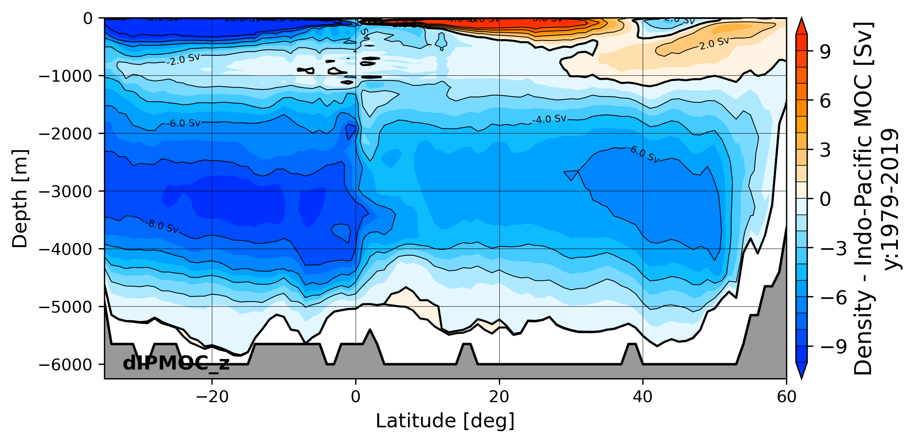

#  ----------------- Tripyview ----------------- 
<br />
<br />
<br />
<br />
Triangular plotting and diagnostics for FESOM2 + command line utility similar to 
fdiag using plotting suite of Patrick.Scholz@awi.de (former fesom2/view_pscholz folder). 
Data reading got updated to xarray, plotting got updated to cartopy, actually works well for python3.7
<br />

## Installation

In moment only possible by source files using pip:

1st. clone respository: 
```bash
git clone https://github.com/patrickscholz/tripyview
```

2nd. install using pip: 
```bash
cd tripyview
pip install -e .
```

## Different diagnostics
### see ./template_notebook/:

* `hslice`       - plot horizontal slices for ocean variable (compute depth and time averages)
* `hslice_clim`  - plot horizontal slices of temperature, salinity and density climatology (compute depth and time averages)

* `hovm`         - plot hovmöller diagramms for 3d ocean varaible over depth and time averaged over
specific region that defined by shapefile (see. tripyview/shapefiles/...)
* `hovm_clim`    - plot hovmöller diagramms for  temperature, salinity and density climatology 
over depth and time averaged over specific region that defined by shapefile (see. tripyview/shapefiles/...)

* `vprofile`     - plot lines for averaged vertical profile of 3d ocean varíables
* `vprofile_clim`- plot lines for averaged vertical profile of 3d temperature, salinity and density climatology

* `zmeantransect`- plot zonally averaged transects of 3d ocean varíables
* `zmeantransect_clim`- plot zonally averaged transects of 3d temperature, salinity and density climatology

* `xmoc`         - plot meridional overturning circulation from vertical velocity (based on latitudinal binning), Globally, 
for the: Atlantic(amoc), Atlantic+Arctic(aamoc), Pacific(pmoc), Pacific+Indian Ocean(ipmoc) and Indian Ocean(imoc)

<p align="left" width="100%">
  
  
  
</p>

* `xmoc_tseries` - plot timeseries of atlantic meridional overturning circulation at specific latitudes 
(default: which_lats: [26, 40, 'max'])

* `dmoc`         - plot meridional overturning circulation in density  coordinates using FESOM2 density MOC diagnostics (graditues goes to **Dmitry.Sidorenko@awi.de**), Globally, 
for the: Atlantic(amoc), Atlantic+Arctic(aamoc), Pacific(pmoc), Pacific+Indian Ocean(ipmoc) and Indian Ocean(imoc)
* `dmoc_srf`     - plot surface transformation of meridional overturning circulation in density coordinates
* `dmoc_inner`   - plot inner transformation of meridional overturning circulation in density coordinates

<p align="left" width="100%">
  
  
  
</p>

* `dmoc_z`, `dmoc_srf_z`, `dmoc_inner_z` - plot meridional overturning circulation in density coordinates back into z-coordinate space 

<p align="left" width="100%">
  
  
  
</p>

* `dmoc_wdiap`   - plot diapycnal velocity for specific water-class

* `dmoc_srfcbflx`- plot surface buoyancy flux transformation for specific water-class

* `dmoc_tseries` - plot timeseries of atlantic meridional overturning circulation in density coordinates at specific latitudes 
(default: which_lats: [26, 55, 'max'])

* `transect`     - plot point wise transects of 3d ocean varíables
* `transect_clim`- plot point wise transects of 3d temperature, salinity and density climatology
* `transect_vflx_t`- plot timeseries of volume transport trough zonal or meridional transect (default: Drake Passage, 
uses pyfesom2 transport utility)

* `3dsphere`     - plot 3d model of FESOM grid with variables using pyvista interface
<p align="center" width="100%">
  
</p>

* `make 3D animations`
<p align="center" width="100%">
<a href="https://www.youtube.com/watch?v=Gokzel60GFk" title="Movie core2 bathymetry"></a> <a href="https://www.youtube.com/watch?v=_8onDgsbLiQ" title="Movie core2 resolution"></a>
</p>

### command line batch diagnostics:
`diagrun <workflowfile.yml>` - command line diagnostics similar to fdiag (fdiag, served as a 
template, graditues go to Nikolay.Koldunov@awi.de), creates html files with linked plots

## Credits:
If you use the package please give the package or the author some credit.

