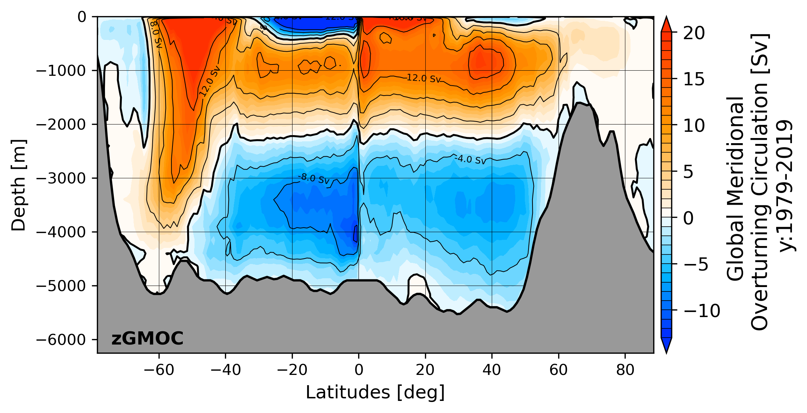
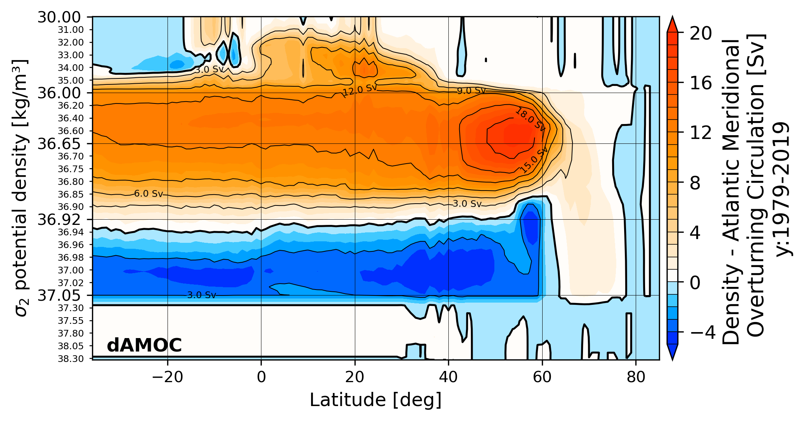
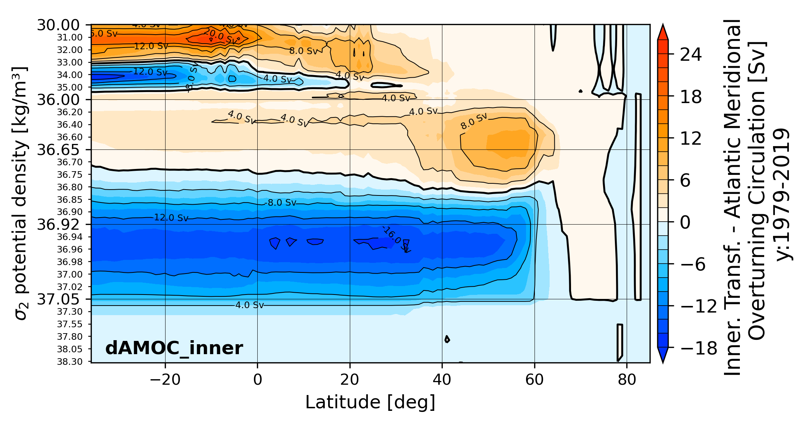
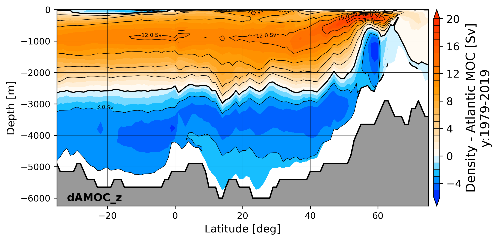

<p align="center" width="100%">
  
</p>
<br />
Triangular plotting and diagnostics for FESOM2 + command line utility similar to 
fdiag using plotting suite of Patrick.Scholz@awi.de (former fesom2/view_pscholz folder). 
Data reading got updated to xarray, plotting got updated to cartopy, actually works well for 
python=3.9, 3.10, 3.11 and 3.12 (python 3.8 made recently some problems to resolve all the cartopy dependencies). 
It is tested up to dart mesh size (3M surface vertices) where it allows for a decent
working speed (but only when used in parallel)
<br />
version: 0.3.0
<br />

## Installation

In moment only possible by source files using pip:

### 1st. clone respository: 
```bash
git clone https://github.com/patrickscholz/tripyview
```

### 2nd. install using conda & pip : 
make sure your conda environment uses python 3.9, 3.10, 3.11 or 3.12
(conda create --name py39 python=3.9; conda activate py39)

```bash
# -netcdf4>=1.6.1 can be used now, there were problems with the thread safety of 
#  netcdf4 (occured especially on albedo), there was a workaround with
#  dask.config.set(scheduler="single-threaded") to ensure that each worker only 
#  gets one thread
# -install libstdcxx-ng with conda since there is no pip package for it is needed
#  so that pyvista is able to plot interactively
# -all other packages will be automatically installed by pip
conda install -c conda-forge libstdcxx-ng
cd tripyview
pip install -e .

# On my laptop i had problems with the classic notebook support beyond jupyter_server==2.0.0
# and had to downgrade it to jupyter_server<2.0.0. However on HPC albedo that did not
# seems to be the case.
(pip install "jupyter_server<2.0.0")
```

## Different diagnostics
#### see ./template_notebook/:
It is recommented to leave the template_notebooks unaltered since they are needed by the tripyrun (papermill)
batch diagnostic. If you want to work on them simply copy them to the ./notebook folder.
<br />

### General horizontal plots: 
* `hmesh`          - plot horizontal fesom2 mesh in various projections (plot: mesh, topographie, 
vertice/element- resolution and area)
<p align="center" width="100%">
  
  
</p>


* `hslice`           - plot horizontal slices for ocean variable (compute depth and time averages)
* `hslice_np`        - plot horizontal slices for ocean variable north polar stereographic projection
* `hslice_sp`        - plot horizontal slices for ocean variable south polar stereographic projection
* `hslice_clim`      - plot horizontal slices of temperature, salinity and density climatology (compute depth and time averages)
* `hslice_clim_np`   - plot horizontal slices of temperature, salinity and density climatology in north polar stereographic projection
* `hslice_clim_sp`   - plot horizontal slices of temperature, salinity and density climatology in south polar stereographic projection
* `hslice_isotdep`   - plot horizontal slices of depth of distinct isotherm (default: 12°C isotherm)


* `hslice_channel`   - plot horizontal slices of variables in the channel configuration (provide routine to make channel movie)
<p align="center" width="100%">
  
</p>


* `hquiver`          - plot horizontal arrow vector field in various projections
<p align="center" width="100%">
  
</p>


### General vertical plots: 
* `transect`         - plot point wise transects of 3d ocean variables
* `transect_clim`    - plot point wise transects of 3d temperature, salinity and density climatology
* `transect_transp`  - plot volume transport through arbitrary transects (model accurate transport)
* `transect_transp_t`- plot time-series of volume transport through arbitrary transects (fesom2 model accurate transport)
* `transect_zmean`   - plot zonally averaged transects of 3d ocean variables
* `transect_zmean_clim`- plot zonally averaged transects of 3d temperature, salinity and density climatology
<p align="center" width="100%">
  
  
  
</p>


* `vprofile`         - plot lines for averaged vertical profile of 3d ocean variables
* `vprofile_clim`    - plot lines for averaged vertical profile of 3d temperature, salinity and density climatology
<p align="center" width="100%">
  
</p>


### General time plots: 
* `hovm`             - plot hovmöller diagrams for 3d ocean variable over depth and time averaged over
specific region that is defined by shapefile (see. tripyview/shapefiles/...)
* `hovm_clim`        - plot hovmöller diagrams for  temperature, salinity and density climatology 
over depth and time averaged over specific region that is defined by shapefile (see. tripyview/shapefiles/...)

* `var_t`            - plots time-series of globally or shapefile (see. tripyview/shapefiles/...) averaged 2d and 3d variables 


### Transports/Streamfunctions: 
* `zmoc`             - plot meridional overturning circulation from vertical velocity (based on latitudinal binning), Globally, 
for the: Atlantic(amoc), Atlantic+Arctic(aamoc), Pacific(pmoc), Pacific+Indian Ocean(ipmoc) and Indian Ocean(imoc)
<p align="left" width="100%">
  
  
  
</p>


* `zmoc_t`           - plot time-series of Atlantic meridional overturning circulation at specific latitudes 
(default: which_lats: [26, 40, 'max'])


* `dmoc`             - plot meridional overturning circulation in density coordinates using FESOM2 density MOC diagnostics (gratitude goes to **Dmitry.Sidorenko@awi.de**), Globally, 
for the: Atlantic(amoc), Atlantic+Arctic(aamoc), Pacific(pmoc), Pacific+Indian Ocean(ipmoc) and Indian Ocean(imoc)
* `dmoc_srf`         - plot surface transformation of meridional overturning circulation in density coordinates
* `dmoc_inner`       - plot inner transformation of meridional overturning circulation in density coordinates

<p align="left" width="100%">
  
  
  
</p>


* `dmoc_z`, `dmoc_srf_z`, `dmoc_inner_z` - plot meridional overturning circulation in density coordinates remapped into z-coordinate space
<p align="left" width="100%">
  
  
  
</p>


* `dmoc_wdiap`       - plot diapycnal velocity for specific water-class
* `dmoc_srfcbflx`    - plot surface buoyancy flux transformation for specific water-class


* `dmoc_t`           - plot time-series of Atlantic meridional overturning circulation in density coordinates at specific latitudes 
(default: which_lats: [26, 55, 'max'])


* `hbarstreamf`      - plot horizontal barotropic streamfunction 


* `ghflx`            - plots global meridional heat flux computed from surface heatfluxes fh
* `mhflx`            - plots global meridional heat flux computed from the the turbulent fluxes temp*v, temp*u
* `zhflx`            - plots global zonal heat flux computed from the the turbulent fluxes temp*v, temp*u


### 2D automatic multipanel plotting: 
* plot automatised figure multi-panels depending on number of chosen datasets and number
of panel columns ncol (the panel arrangement uses ideas from **Nils.Brueggemann@mpimet.mpg.de**)
<p align="center" width="100%">
  
</p>


### 3D plotting: 
* `3dsphere`         - plot 3d model of FESOM grid with variables using pyvista interface. Full functionality can be only achieved with jupyter-lab (<4.0)
<p align="center" width="100%">
  
</p>

* `make 3D animations`
<p align="center" width="100%">
<a href="https://www.youtube.com/watch?v=Gokzel60GFk" title="Movie core2 bathymetry"></a> <a href="https://www.youtube.com/watch?v=_8onDgsbLiQ" title="Movie core2 resolution"></a>
</p>


## Command line batch diagnostics:
* `tripyrun  <workflowfile.yml>` - command line diagnostics similar to fdiag (fdiag, served as a 
template, gratitude go to **Nikolay.Koldunov@awi.de**), creates html files with linked plots.

* `tripyrun  <workflowfile.yml> -d <driver>` - re-run one specific driver from .yml file 

* `tripyrun  <workflowfile.yml> -d <driver> -v <var1 var2 ...>` - re-run specific variable 
subset of one specific driver driver from .yml file

* `tripyrun  <workflowfile.yml> -r` - for the case the diagnostic did not fully finish you can 
render the html file from hand based on the saved json file. The json file is update after each finished
driver section.

<p align="center" width="100%">
  
</p>

## Credits:
If you use the package please give the package or the author some credit.

